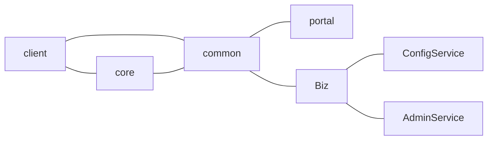

# 1 Analysis of Variations
## Do you Know how to Analysis
Recently I was invite to the closing ceremony of a team tournament in which both candidate masters and first-category players were playing. I asked my audience what they would like me to talk to them about, and I was inundated with requests. Some players asked me to demostrate an interesting combination, while others wanted to know how to play the Sicilian Defence correctly for Black.

'But do you know how to analyse variations?' I asked my listeners, and without giving them time to reply went to, 'I will show you how to analyse variations and if I'm wrong, then stop me. Let us suppose that at one point in your game you have a choice between two moves, Rd1 or Ng5. Which should you play? You settle down comfortably in your chair and start your analysis by silently saying to yourself the possible moves. "All right, I could play Rd1 and he would probably play ...Bb7, or he could take my a-pawn, which is now undefended. What then? Do I like the look of the position then?" You go one move further in your analysis and then you pull a long face - the rook move no longer appeals to you. Then you look at the knight move. "What if I go Ng5? He can drive it away by ...h6, I go Ne4, he captures it with his bishop. I recaptures and he attacks my queen with his rook. That doesn't look very nice ... so the knight move is no good. Let's look at the rook move again. If he plays ...Bb7 I can reply f3, but what if he captures my a-pawn. What can I play then? No, the rook move is no good. I must check the knight move again. So, Ng5,h6;Ne4,Bxe4;Qxe4,Rd4. No good! So I mustn't move the knight. 

### Historical Digression
## The Tree of Analysis
## Forced and Unforced Variations
<!--stackedit_data:
eyJoaXN0b3J5IjpbODI0OTk2MTg2XX0=
-->